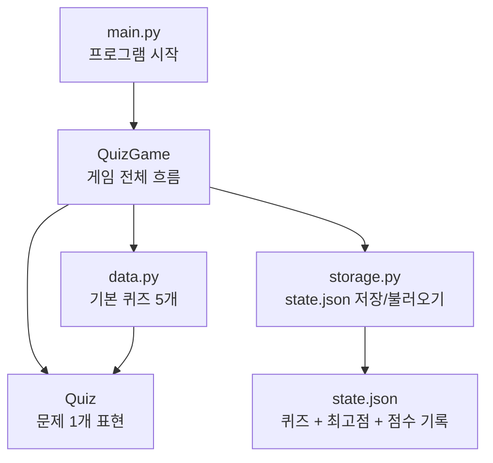
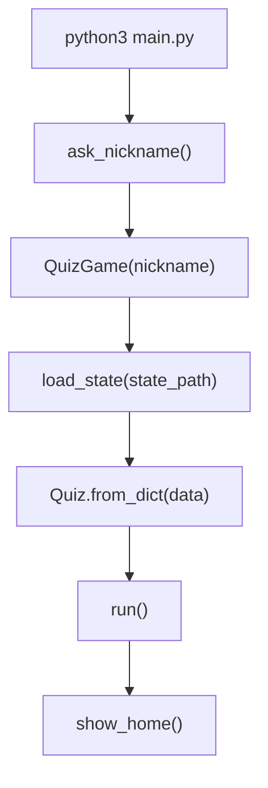
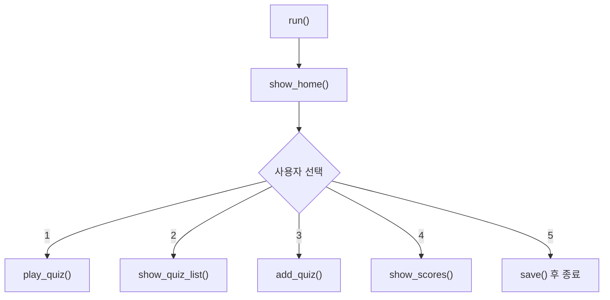
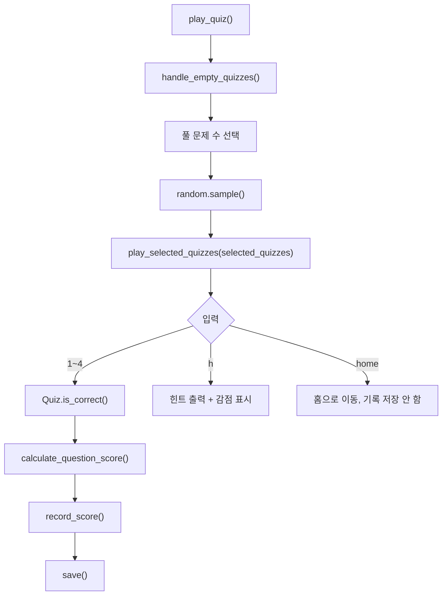
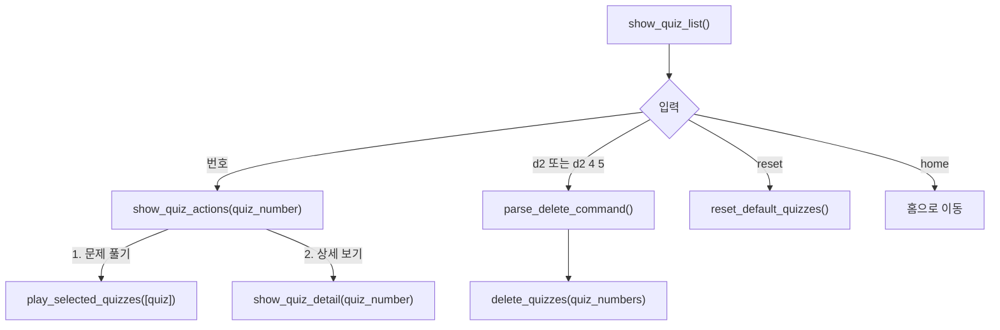
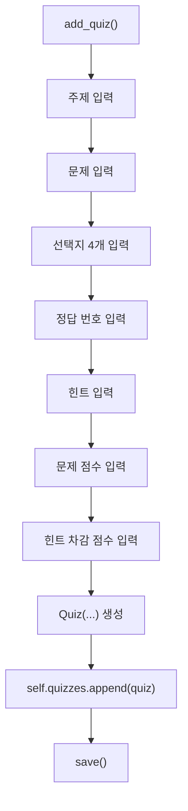
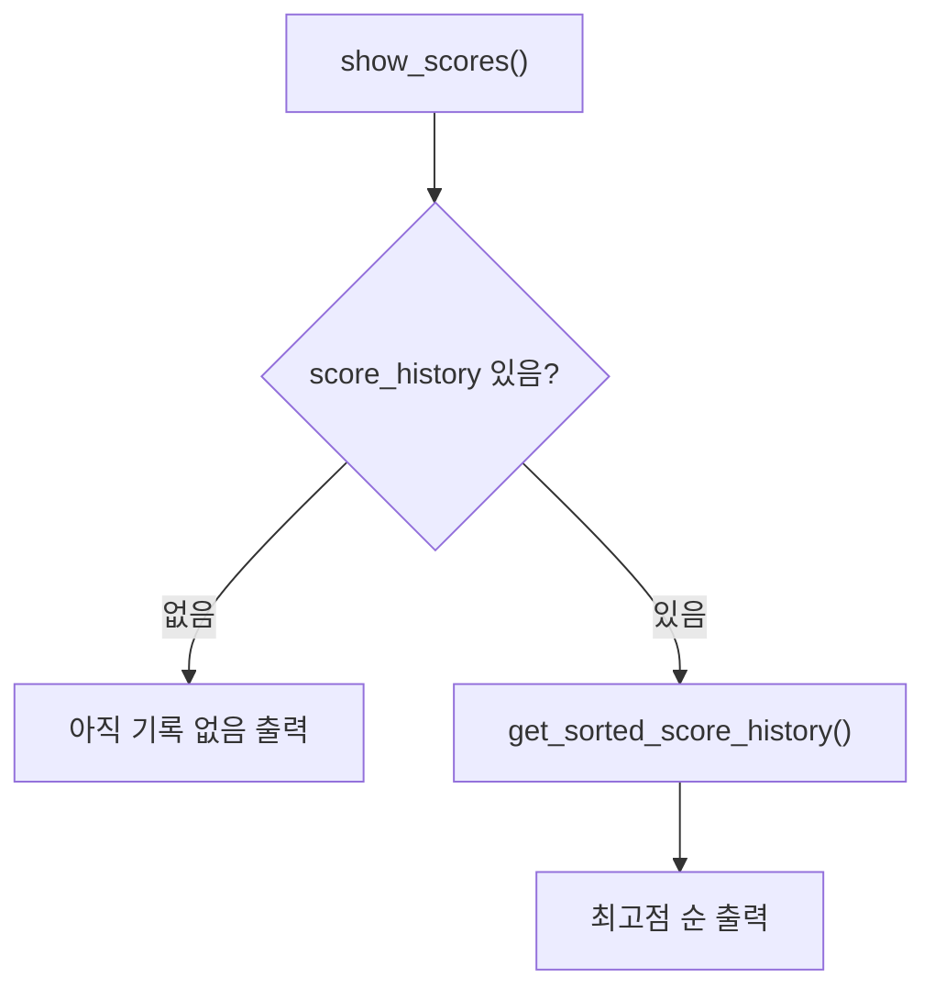
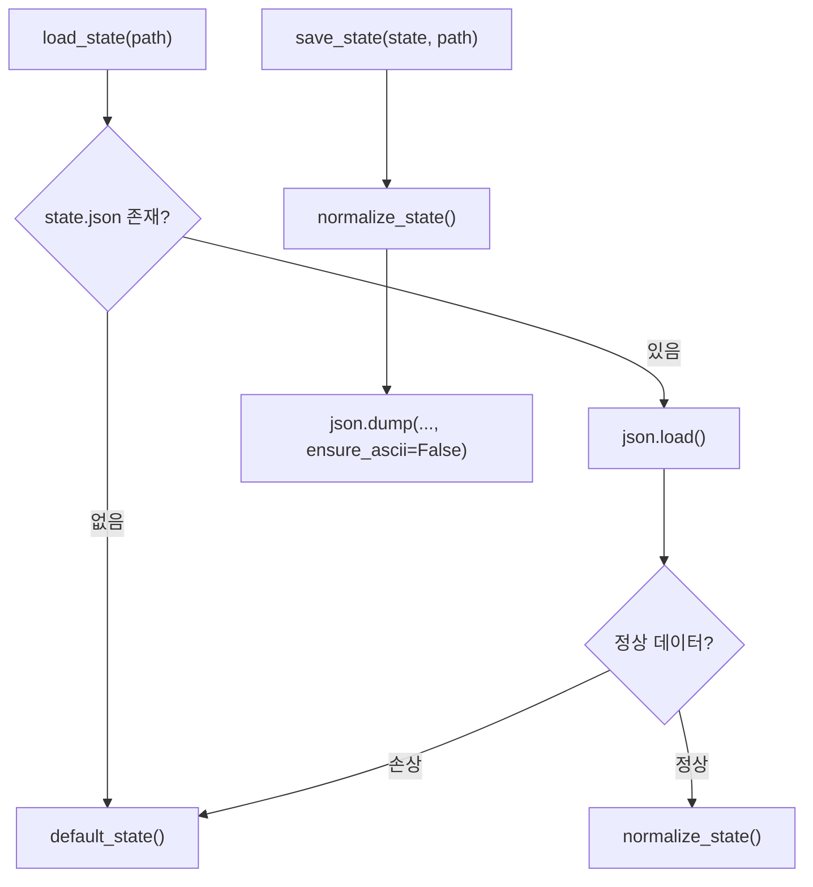
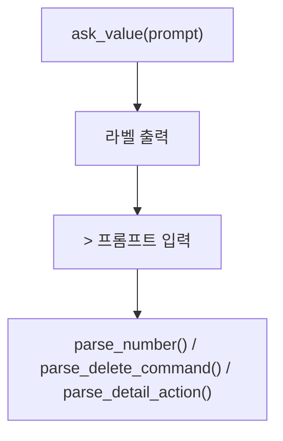

# 코드 구조와 실행 흐름

이 문서는 퀴즈 게임 코드를 읽으면서 흐름을 따라가기 위한 학습용 문서입니다. 각 함수 링크는 GitHub에서 클릭하면 해당 코드 위치로 이동합니다.

## 1. 전체 구조

역할 분리:

- [`main.py`](../main.py): 프로그램 시작점
- [`quiz.py`](../quiz.py): 문제 하나를 표현하는 `Quiz` 클래스
- [`quiz_game.py`](../quiz_game.py): 메뉴와 게임 흐름을 관리하는 `QuizGame` 클래스
- [`storage.py`](../storage.py): JSON 저장과 불러오기
- [`data.py`](../data.py): 기본 퀴즈 데이터

## 2. 프로그램 시작 플로우

함수 흐름:

| 순서 | 함수 | 인자 | 리턴 | 설명 |
|---|---|---|---|---|
| 1 | [`main()`](../main.py#L21) | 없음 | 없음 | 프로그램 실행 시작 |
| 2 | [`ask_nickname()`](../main.py#L4) | 없음 | `str` | 사용자 닉네임 입력 |
| 3 | [`QuizGame.__init__()`](../quiz_game.py#L12) | `nickname`, `state_path="state.json"` | `QuizGame` 객체 | 저장 데이터를 읽고 게임 상태 생성 |
| 4 | [`load_state()`](../storage.py#L19) | `path` | `dict` | `state.json`을 읽거나 기본 상태 생성 |
| 5 | [`Quiz.from_dict()`](../quiz.py#L39) | `dict` | `Quiz` | 저장된 dict를 Quiz 객체로 복원 |
| 6 | [`run()`](../quiz_game.py#L96) | 없음 | 없음 | 홈 메뉴 반복 실행 |

## 3. 홈 메뉴 플로우

함수 흐름:

| 선택 | 함수 | 인자 | 리턴 | 설명 |
|---|---|---|---|---|
| 메뉴 표시 | [`show_home()`](../quiz_game.py#L123) | 없음 | `int` | 1~5 메뉴 번호 반환 |
| 입력 처리 | [`get_number()`](../quiz_game.py#L88) | `prompt`, `min_value`, `max_value` | `int` 또는 `"home"` | 숫자 범위와 `home` 처리 |
| 입력 파싱 | [`parse_number()`](../quiz_game.py#L21) | `raw_value`, `min_value`, `max_value` | `int`, `"home"`, `None` | 빈 입력, 문자, 범위 밖 숫자 처리 |
| 종료 저장 | [`save()`](../quiz_game.py#L299) | 없음 | 없음 | 현재 상태를 `state.json`에 저장 |

예외 처리:

- [`run()`](../quiz_game.py#L96)은 `KeyboardInterrupt`를 잡아 안내 후 홈으로 돌아갑니다.
- [`run()`](../quiz_game.py#L96)은 `EOFError`를 잡아 저장 후 안전 종료합니다.

## 4. 퀴즈 풀이 플로우

함수 흐름:

| 함수 | 인자 | 리턴 | 설명 |
|---|---|---|---|
| [`play_quiz()`](../quiz_game.py#L136) | 없음 | 없음 | 문제 수를 선택하고 랜덤 문제를 뽑음 |
| [`handle_empty_quizzes()`](../quiz_game.py#L385) | 없음 | `bool` | 문제가 없을 때 등록/초기화 선택지 제공 |
| [`play_selected_quizzes()`](../quiz_game.py#L148) | `list[Quiz]` | `None` 또는 `"home"` | 실제 문제 풀이 진행 |
| [`Quiz.is_correct()`](../quiz.py#L24) | `choice_number` | `bool` | 사용자의 답이 정답인지 확인 |
| [`calculate_question_score()`](../quiz_game.py#L405) | `quiz`, `used_hint`, `correct` | `int` | 정답/힌트 사용 여부에 따라 점수 계산 |
| [`record_score()`](../quiz_game.py#L412) | `score`, `total_possible_score`, `quiz_count`, `correct_count`, `used_hint_count` | 없음 | 날짜, 닉네임, 점수 기록 저장 |

설계 포인트:

- 문제 순서는 `random.sample()`로 섞습니다.
- 힌트를 사용하면 [`calculate_question_score()`](../quiz_game.py#L405)에서 `points - hint_penalty`로 계산합니다.
- 풀이 중 `home`을 입력하면 완료한 풀이가 아니므로 점수 기록을 저장하지 않습니다.

## 5. 퀴즈 목록, 상세 보기, 삭제 플로우

함수 흐름:

| 함수 | 인자 | 리턴 | 설명 |
|---|---|---|---|
| [`show_quiz_list()`](../quiz_game.py#L207) | 없음 | 없음 | 퀴즈 목록, 삭제, 초기화, 상세 선택 처리 |
| [`parse_delete_command()`](../quiz_game.py#L36) | `raw_value`, `quiz_count` | `list[int]` 또는 `None` | `d2`, `d2 4 5` 형식 삭제 명령 파싱 |
| [`parse_reset_command()`](../quiz_game.py#L85) | `raw_value` | `bool` | `reset` 명령인지 확인 |
| [`show_quiz_actions()`](../quiz_game.py#L355) | `quiz_number` | `None` 또는 `"home"` | 선택한 문제를 풀지, 상세 보기할지 선택 |
| [`parse_detail_action()`](../quiz_game.py#L57) | `raw_value` | `"play"`, `"detail"`, `"home"`, `None` | 문제 선택 후 액션 파싱 |
| [`show_quiz_detail()`](../quiz_game.py#L314) | `quiz_number` | 없음 | 문제, 선택지, 정답, 힌트, 점수 출력 |
| [`delete_quizzes()`](../quiz_game.py#L328) | `list[int]` | 없음 | 단일 또는 여러 퀴즈 삭제 |
| [`delete_single_quiz()`](../quiz_game.py#L345) | `quiz_number` | 없음 | 단일 퀴즈 삭제 확인 |
| [`reset_default_quizzes()`](../quiz_game.py#L373) | 없음 | `bool` | 기본 퀴즈 5개로 초기화 |

설계 포인트:

- 삭제할 문제가 1개면 문제 제목을 보여주고 확인합니다.
- 삭제할 문제가 2개 이상이면 주제만 모아서 보여주고 확인합니다.
- `reset`은 문제가 0개가 아니어도 목록 화면에서 사용할 수 있습니다.

## 6. 퀴즈 등록 플로우

함수 흐름:

| 함수 | 인자 | 리턴 | 설명 |
|---|---|---|---|
| [`add_quiz()`](../quiz_game.py#L242) | 없음 | 없음 | 사용자 입력으로 새 퀴즈 등록 |
| [`get_text()`](../quiz_game.py#L305) | `prompt` | `str` 또는 `"home"` | 빈 입력과 `home` 처리 |
| [`get_number()`](../quiz_game.py#L88) | `prompt`, `min_value`, `max_value` | `int` 또는 `"home"` | 정답 번호, 점수 입력 처리 |
| [`Quiz.__post_init__()`](../quiz.py#L14) | 없음 | 없음 | 선택지 4개, 정답 번호 1~4 등 검증 |
| [`save()`](../quiz_game.py#L299) | 없음 | 없음 | 등록된 퀴즈를 저장 |

## 7. 점수 확인 플로우

함수 흐름:

| 함수 | 인자 | 리턴 | 설명 |
|---|---|---|---|
| [`show_scores()`](../quiz_game.py#L281) | 없음 | 없음 | 점수 기록 출력 |
| [`get_sorted_score_history()`](../quiz_game.py#L68) | `score_history` | `list[dict]` | 점수 높은 순으로 정렬 |
| [`record_score()`](../quiz_game.py#L412) | 점수 관련 값들 | 없음 | 풀이 완료 기록을 `score_history`에 추가 |

## 8. 저장과 복구 플로우

함수 흐름:

| 함수 | 인자 | 리턴 | 설명 |
|---|---|---|---|
| [`default_state()`](../storage.py#L11) | 없음 | `dict` | 기본 퀴즈와 초기 점수 상태 생성 |
| [`load_state()`](../storage.py#L19) | `path="state.json"` | `dict` | 저장 파일 읽기, 없거나 손상되면 기본값 반환 |
| [`save_state()`](../storage.py#L32) | `state`, `path="state.json"` | `bool` | UTF-8 JSON 저장, 실패 시 `False` |
| [`normalize_state()`](../storage.py#L42) | `state` | `dict` | `Quiz` 객체와 dict를 저장 가능한 형태로 정리 |
| [`Quiz.to_dict()`](../quiz.py#L27) | 없음 | `dict` | Quiz 객체를 JSON 저장 가능한 dict로 변환 |
| [`Quiz.from_dict()`](../quiz.py#L39) | `dict` | `Quiz` | 저장된 dict를 Quiz 객체로 복원 |

## 9. 입력 처리 설계

입력 관련 함수:

| 함수 | 인자 | 리턴 | 설명 |
|---|---|---|---|
| [`ask_value()`](../quiz_game.py#L72) | `prompt` | `str` | 한글 라벨과 입력 커서를 분리해 입력 받음 |
| [`confirm()`](../quiz_game.py#L80) | `prompt` | `str` | 삭제/초기화 확인 입력 |
| [`parse_number()`](../quiz_game.py#L21) | `raw_value`, `min_value`, `max_value` | `int`, `"home"`, `None` | 숫자 입력 공통 검증 |
| [`parse_delete_command()`](../quiz_game.py#L36) | `raw_value`, `quiz_count` | `list[int]`, `None` | 삭제 명령 검증 |
| [`parse_detail_action()`](../quiz_game.py#L57) | `raw_value` | `str`, `None` | 목록에서 문제 선택 후 행동 검증 |

한글 입력 삭제 밀림을 줄이기 위해 `input("문제: ")`처럼 한글 프롬프트와 입력값을 같은 줄에 두지 않고, [`ask_value()`](../quiz_game.py#L72)에서 라벨을 먼저 출력한 뒤 `> ` 프롬프트에서 입력받습니다.
